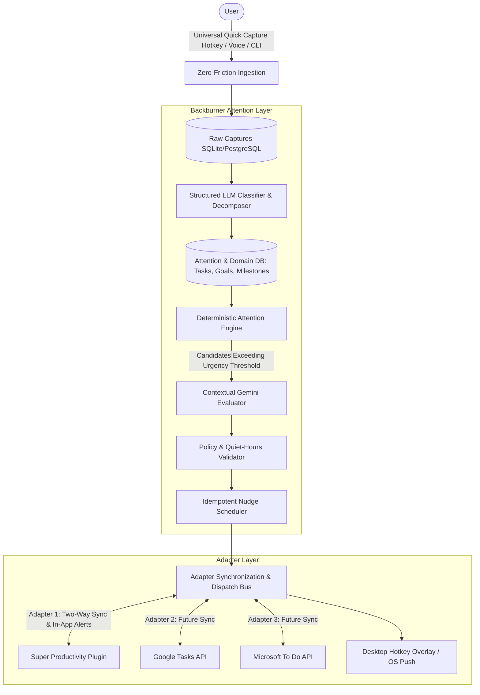

> LEGACY DOCUMENTATION — archived 2026-09-07 from Backburner/docs/ARCHITECTURE.md. Historical context only; original claims and instructions below are not current Burner Board requirements. Read the archive README and the active roadmap before using.

# Backburner System Architecture

---

## 1. Executive Overview

**Backburner** is an **intelligent attention layer for task-management systems**. It monitors unfinished commitments, decaying goals, and stale tasks across external task tools and proactively decides when they deserve the user's attention again.

Rather than being *another* to-do application that stores checkboxes, Backburner acts as an autonomous executive-function supervisor that sits over whatever task management tools the user already relies on.



---

## 2. Core Architectural Pillars

### 2.1 Attention Layer Over Existing Task Systems
Backburner does not require users to abandon their existing productivity apps. Instead, it connects via **Adapters** to read task state, compute staleness and attention metrics, decompose ambitious goals into actionable items, and surface intelligent re-engagement prompts within those tools.

### 2.2 Deterministic Attention First, LLM Reasoning Second
- **Attention Engine**: Calculates numerical `AttentionScore` deterministically based on priority weight, deadline proximity, inactivity/staleness, and ignored nudge count.
- **LLM Reasoning (Gemini)**: Invoked **only** when an item crosses the attention threshold and requires contextual semantic analysis, decomposition, or human-like phrasing. The system never polls LLMs on an indiscriminate loop.

### 2.3 First-Class Separation of Tasks, Goals, Projects, and Notes
- **Tasks**: Actionable atomic work units with discrete completion states.
- **Goals**: Multi-horizon outcomes with target metrics, decomposed into measurable milestones and active weekly/daily child tasks.
- **Projects**: Multi-task initiatives with defined boundaries and deliverables.
- **Notes**: Static reference context with zero actionable overhead.

### 2.4 Dual Priority Model
- `user_priority`: Explicit human intent (`P0` Urgent, `P1` High, `P2` Normal, `P3` Someday).
- `ai_priority`: Context-derived recommendation from deadline proximity, dependencies, and historical patterns.
- `effective_priority`: Deterministic runtime calculation with transparent explanation ("*Suggested P1 because trip is in 7 weeks*").

### 2.5 Idempotent Event-Driven Nudge Engine
- Persisted scheduling state with retry and idempotency keys.
- Escalation policies based on priority level and consecutive ignored nudges.
- Missed-job recovery and quiet-hours enforcement.

---

## 3. Subsystem Breakdown

### 3.1 Zero-Friction Capture & Classification Pipeline
```text
Raw Capture (Text/Audio via Ctrl+Shift+Space)
        ↓
Fast Write (<50ms) to Local Store
        ↓
Async Worker: Gemini Structured Output (Pydantic schema)
        ↓
[ Type: Task | Goal | Project | Note ]
[ Title, Inferred Deadlines, Effort, Decomposition Flags ]
        ↓
Promote to Attention & Domain Tables
```

### 3.2 Attention & Re-engagement Loop
```text
State Mutation / Periodic Daemon
        ↓
Compute AttentionScore for all Active Items
        ↓
Filter Candidates: AttentionScore >= Threshold
        ↓
Build Context (History, Deadlines, Ignored Count, Related Goals)
        ↓
Gemini Contextual Evaluation -> Structured Action (NUDGE | ASK | DECOMPOSE | ESCALATE)
        ↓
Nudge State Machine (Delivered -> Acknowledged / Snoozed / Ignored)
```

### 3.3 Adapter Architecture
Backburner Core exposes clean interfaces for bidirectional task synchronization and notification dispatch:
- **`TaskReader` / `TaskWriter`**: Ingest and push tasks from external clients.
- **`NudgeChannel`**: Abstract notification sink (Desktop toast, Super Productivity notification, Web Push).
- **`SP-Plugin / SP-MCP`**: Dedicated adapter bridging Backburner Core with Super Productivity's local task database.

---

## 4. Evaluation & Test-Driven AI Architecture

Backburner treats LLM prompts and attention policies as code with rigorous evaluation suites (`tests/evals/`):

```text
tests/evals/
├── captures.jsonl           # Benchmark testcases for task/goal/note classification
├── decomposition.jsonl      # Evaluation datasets for goal-to-milestone breakdowns
├── priority_scenarios.jsonl # Edge cases for dual priority & urgency calculations
└── reminder_scenarios.jsonl # Contextual phrasing and tone quality benchmarks
```

---

## 5. Technology Stack

- **Core Backend**: Python / FastAPI or TypeScript / Fastify.
- **Persistence**: SQLite (Local-first) with PostgreSQL support via SQLModel / Prisma.
- **LLM Reasoning**: Google Gemini API with strict structured outputs (`response_format` / Pydantic).
- **Client / UI**: Desktop overlay (Tauri/Electron), Super Productivity Plugin, and CLI tooling.
