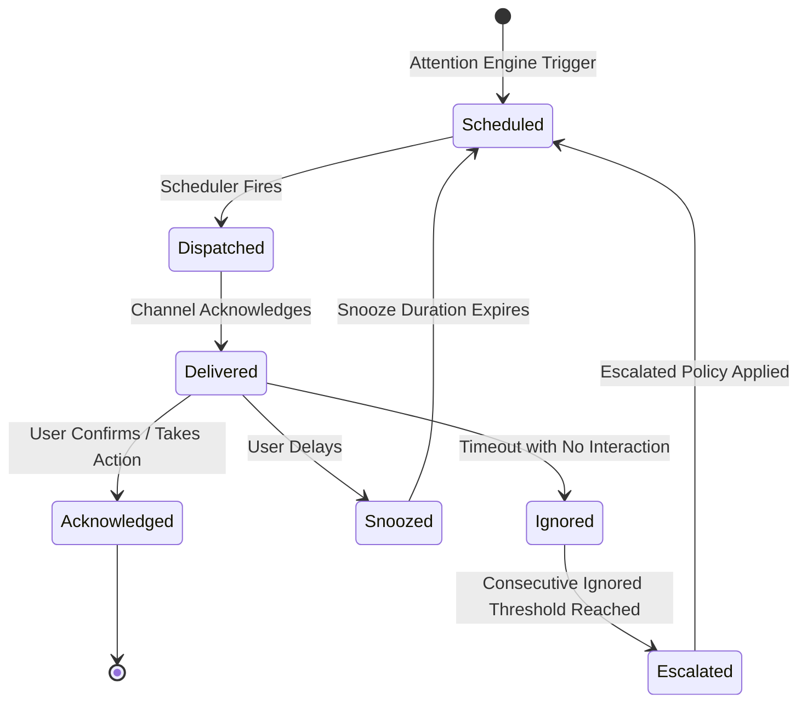

> LEGACY DOCUMENTATION — archived 2026-09-07 from Backburner/specs/nudge-engine.md. Historical context only; original claims and instructions below are not current Burner Board requirements. Read the archive README and the active roadmap before using.

# Technical Specification: Idempotent Nudge Engine & Re-engagement Scheduler

---

## 1. Overview
The Nudge Engine is responsible for scheduling, dispatching, and managing the lifecycle of proactive user notifications. It must operate reliably with idempotency, retry logic, missed-job recovery, and escalation policies.

## 2. Nudge Lifecycle State Machine



## 3. Idempotency & Persistence
- Every scheduled nudge receives a deterministic `idempotency_key` based on `(item_id, trigger_date, escalation_level)`.
- If the system restarts or crashes, the scheduler performs a **missed-job recovery scan** on boot:
  - Jobs missed by $< 2\text{ hours}$ are dispatched immediately (respecting quiet hours).
  - Jobs missed by $> 2\text{ hours}$ are rolled into the next active evaluation cycle rather than flooding the user with stale backlog alerts.

## 4. Escalation Policies by Priority Level

| Priority | Re-alert Cadence | Escalation Behavior |
| :--- | :--- | :--- |
| **`P0` (Critical)** | Continuous until acknowledged (15m, 1h, 3h, alarm mode) | High-visibility toast, desktop overlay, persistent sound |
| **`P1` (High)** | Same-day $\rightarrow$ Next day $\rightarrow$ Day 3 $\rightarrow$ Conversational Reassessment | Progressive tone change from informational to re-evaluating value |
| **`P2` (Normal)** | Periodic (3–7 day interval) | Gentle check-in; surfaces in daily focus list |
| **`P3` (Someday)** | Weekly / Bi-weekly review | Surfaced strictly during weekly review sessions |

## 5. Quiet Hours & Delivery Channels
- Default Quiet Hours: 22:00 – 08:00 local time (configurable). Non-`P0` alerts are deferred until the start of the next active window.
- Abstract Channel Interface:
  ```python
  class NudgeChannel(Protocol):
      async def send(self, payload: NudgePayload) -> DeliveryReceipt: ...
  ```
